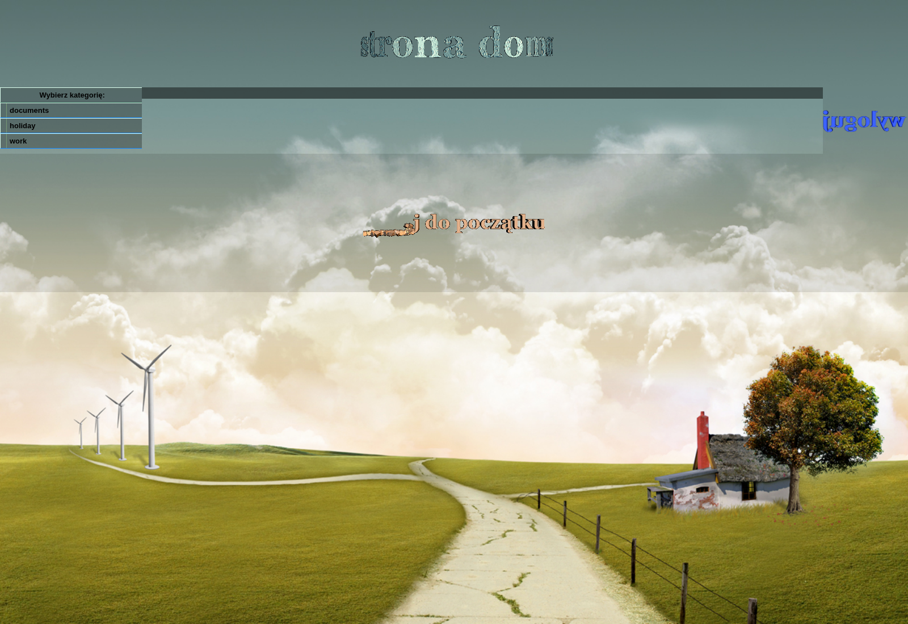
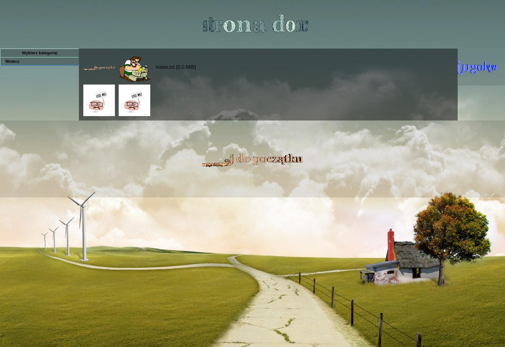

# Gallery

A small PHP web image gallery with BCrypt-authenticated, per-user file collections. Each account browses an isolated tree of images, videos, and downloads, with thumbnails, inline video playback, and a tiny audit log.

[](https://github.com/ArturKos/Gallery/actions/workflows/ci.yml)


[](LICENSE)

## Screenshots

| Login | Gallery — root | Gallery — folder |
|-------|----------------|------------------|
|  |  |  |

## What's interesting about it

- **Front-controller architecture.** Document root is `public/`; everything else (source, config, templates, tests, vendor) lives outside the web-served tree. `public/index.php` is a thin controller that delegates to PSR-4 autoloaded classes in `src/`.
- **Logic / presentation split.** Templates in `templates/` only render — no DB calls, no filesystem traversal, no auth checks. Every interpolation goes through `e()` (`htmlspecialchars` with `ENT_QUOTES | ENT_HTML5`).
- **Path-traversal hardening.** `SafePath::resolveWithin` resolves both candidate and base via `realpath()` and checks containment, so `../../etc/passwd` style inputs cannot escape a user's data directory. Covered by dedicated tests.
- **Constant-time login.** `PasswordVerifier` runs `password_verify` against a dummy hash on unknown usernames so timing differences cannot be used to enumerate accounts.
- **Session hygiene.** `SessionManager` sets `HttpOnly`, `SameSite=Strict`, and `Secure` (when behind HTTPS) on the session cookie, regenerates the session id on login and logout, and exposes a CSRF token used by every state-changing form.
- **Authorized media streaming.** Files live outside the document root; `public/media.php` is the only way to reach them, gated by session and `SafePath`.
- **Test suite.** PHPUnit 10 with 26 tests covering password verification, path-traversal cases, media classification, and directory listing against on-disk fixtures in `sys_get_temp_dir`.
- **Static analysis & style.** PHPStan level 5 and PHP-CS-Fixer (PSR-12 + `declare(strict_types=1)`) wired into Composer scripts.

## Run it

```bash
composer install                                   # installs dev deps + autoloader
cp config/credentials.example.php config/credentials.php
php -r "echo password_hash('your_password', PASSWORD_BCRYPT) . PHP_EOL;"
# paste the hash into config/credentials.php under accounts['username']
mkdir -p accounts/<username>/data
# drop your images, videos, downloads anywhere under accounts/<username>/data
php -S 127.0.0.1:8000 -t public                    # dev server
```

Open <http://127.0.0.1:8000> and log in.

Optional thumbnails: place a same-named copy of an image in a `thumbnails/` subfolder next to the original — the gallery will use it as the preview.

## Quality gates

```bash
composer test       # PHPUnit
composer analyse    # PHPStan level 5
composer lint       # PHP-CS-Fixer (dry-run)
composer fix        # PHP-CS-Fixer (apply fixes)
```

## Layout

```
Gallery/
├── public/                       # document root
│   ├── index.php                 # front controller: routes login/logout/gallery
│   ├── media.php                 # authorized file streamer for /accounts/<user>/data
│   ├── css/{layout,components}.css
│   └── img/                      # static UI assets (banners, buttons)
├── src/                          # PSR-4: ArturKos\Gallery\
│   ├── Auth/PasswordVerifier.php   # BCrypt verify with constant-time fallback
│   ├── Auth/SessionManager.php     # secure cookies, CSRF token, login/logout
│   ├── Auth/LoginAuditLogger.php   # append-only login log
│   ├── SafePath.php                # path-traversal hardening (realpath + containment)
│   ├── DirectoryBrowser.php        # lists subdirs and files under a data root
│   ├── MediaClassifier.php         # filename → MediaType (image / video / download)
│   ├── MediaType.php               # enum
│   └── MediaEntry.php              # immutable file record
├── templates/                    # presentation only
│   ├── helpers.php               # e() / url_path()
│   ├── login.php
│   └── gallery.php
├── config/
│   ├── credentials.example.php   # committed placeholder
│   └── credentials.php           # gitignored: real accounts + paths
├── tests/                        # PHPUnit
│   ├── Auth/PasswordVerifierTest.php
│   ├── Gallery/SafePathTest.php
│   ├── Gallery/MediaClassifierTest.php
│   └── Gallery/DirectoryBrowserTest.php
├── accounts/                     # gitignored: per-user data trees
│   └── <username>/data/...
├── .github/workflows/ci.yml      # GitHub Actions: lint + analyse + test on PHP 8.1/8.2/8.3
├── composer.json
├── phpunit.xml
├── phpstan.neon
├── .php-cs-fixer.dist.php
└── LICENSE
```

## Production notes

- The PHP built-in server is fine for development. In production, point Apache or Nginx at `public/` as the document root and let it serve `media.php` through PHP-FPM.
- `config/credentials.php`, `log.txt`, and `accounts/` are gitignored — they hold per-deployment state and must never be committed.
- For HTTPS deployments the `Secure` cookie flag is set automatically when `$_SERVER['HTTPS']` is non-empty.

## License

[MIT](LICENSE).
